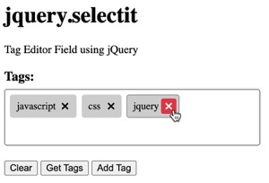

# jquery.selectit - Tag Editor Field using jQuery



## CDN Links

```html
<!-- CSS -->
<link rel="stylesheet" href="https://cdn.jsdelivr.net/gh/crpietschmann/jquery.selectit@v1.0/dist/css/jquery.selectit.css"/>

<!-- Javascript -->
<script src="https://cdn.jsdelivr.net/gh/crpietschmann/jquery.selectit@v1.0/dist/js/jquery.selectit.js"></script>
```

## Usage

Here's a simple sample on how to use this:

```html
    <h3>Tags:</h3>
    <div id="SelectBox" style="width: 350px"></div>
    
    <input id='btnClear' type='button' value='Clear' />
    <input id='btnGetTags' type='button' value='Get Tags' />
    <input id='btnAdd' type='button' value='Add Tag' />

    <script src="https://code.jquery.com/jquery-3.7.1.js"></script>
    <script src="https://cdn.jsdelivr.net/gh/crpietschmann/jquery.selectit@v1.0/dist/js/jquery.selectit.js"></script>
    <link rel="stylesheet" href="https://cdn.jsdelivr.net/gh/crpietschmann/jquery.selectit@v1.0/dist/css/jquery.selectit.css"/>
    <script>
        $(function () {
            $('#SelectBox').selectit({
                fieldname: 'tags',
                values: [
                    'javascript',
                    'css',
                    'jquery'
                ]
            });

            $('#btnGetTags').click(function () {
                alert($('#SelectBox').selectit('values').join(', '));
            });

            $('#btnClear').click(function () {
                $('#SelectBox').selectit('clear');
            });

            $('#btnAdd').click(function () {
                var tag = prompt('Enter tag to add:', '');
                if (tag && tag !== '') {
                    $('#SelectBox').selectit('add', tag);
                }
            });
        });
    </script>
```

Also, the [default.htm](/default.htm) file in this repo is a working example too.

## Change Log

### v1.0 - June 21, 2024

- Modernize the CSS styles
- Ensure compatibility with latest versions of jQuery and Bootstrap
- Added animation: fade in when adding tag, fade out when removing tag
- Enhance box highlighting to highlight the 'selectit' box when 'input' has focus. This makes the behavior act as expected like 'selectit' is more of a native input element.

### v0.1 - 2011

- Initial Release

## Author

This project was created by [Chris Pietschmann](https://www.pietschsoft.com), and originally published in a [blog post](https://www.pietschsoft.com/post/2011/09/09/tag-editor-field-using-jquery-similar-to-stackoverflow) back in 2011. This jQuery plugin has since been updated slightly and put up here on GitHub for broader ability to be used.
